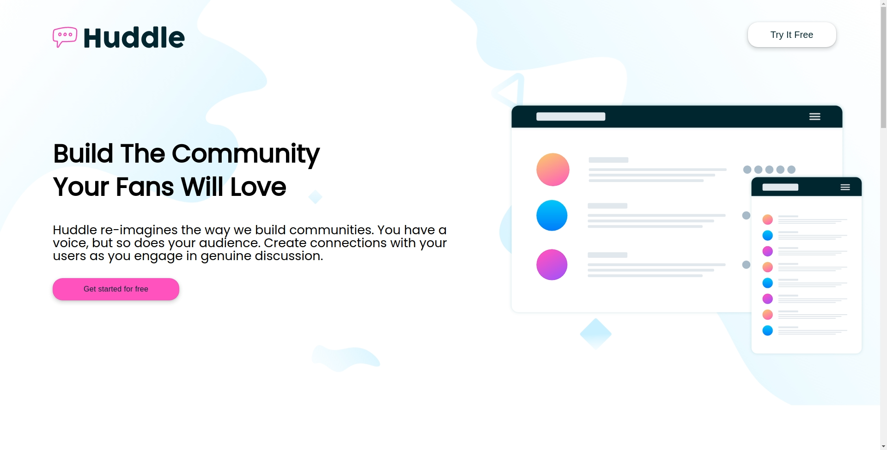

# Frontend Mentor - Huddle landing page with alternating feature blocks solution

This is a solution to the [Huddle landing page with alternating feature blocks challenge on Frontend Mentor](https://www.frontendmentor.io/challenges/huddle-landing-page-with-alternating-feature-blocks-5ca5f5981e82137ec91a5100). Frontend Mentor challenges help you improve your coding skills by building realistic projects. 

## Table of contents

  - [Screenshot](#screenshot)
  - [Links](#links)
- [My process](#my-process)
  - [Built with](#built-with)
  - [Continued development](#continued-development)
- [Author](#author)

**Note: Delete this note and update the table of contents based on what sections you keep.**

### Screenshot

### Links

- Solution URL: [Add solution URL here](https://phyoethantko.github.io/Huddle-frontend/)
- Live Site URL: [Add live site URL here](https://phyoethantko.github.io/Huddle-frontend/)

## My process

### Built with

- Semantic HTML5 markup
- CSS custom properties
- Flexbox
- CSS Grid
- Mobile-first workflow

### Continued development

I'll we moving on to some back-end projects

## Author

- Website - [PTK](https://www.facebook.com/ptk7858)
- Frontend Mentor - [@PhyoeThantKo](https://www.frontendmentor.io/profile/PhyoeThantKo)
- Twitter - [@PhyoeThantKo78(https://twitter.com/PhyoeThantKo78)

